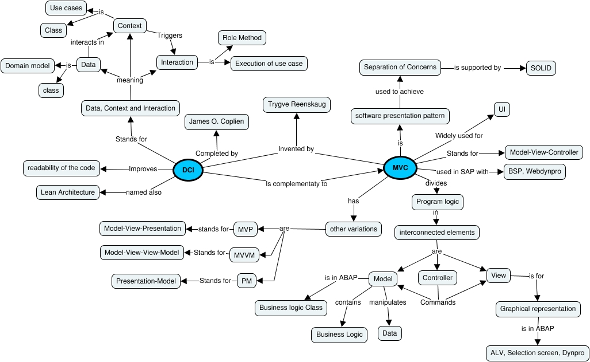

### DCI : Data Context and Interaction
https://en.wikipedia.org/wiki/Data,_context_and_interaction

### MVC : Model View Controller
https://fr.wikipedia.org/wiki/Mod%C3%A8le-vue-contr%C3%B4leur
##### MVC variations : 
- https://manojjaggavarapu.wordpress.com/2012/05/02/presentation-patterns-mvc-mvp-pm-mvvm/
##### MVC in ABAP : 
- https://sapflash.com/abap-object-oriented-with-model-view-controller-mvc-part-1/
- http://zevolving.com/2008/10/abap-objects-design-patterns-model-view-controller-mvc-part-1/

### Concept map 

