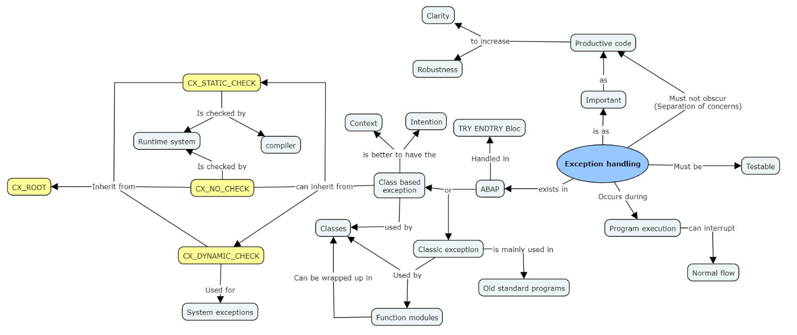

### 
https://www.codingblocks.net/podcast/clean-code-error-handling/
https://www.youtube.com/watch?v=3RtLCav0Bp4
https://michaelfeathers.silvrback.com/a-monadic-approach-to-error-handling-in-collection-pipelines

### Concept map 

